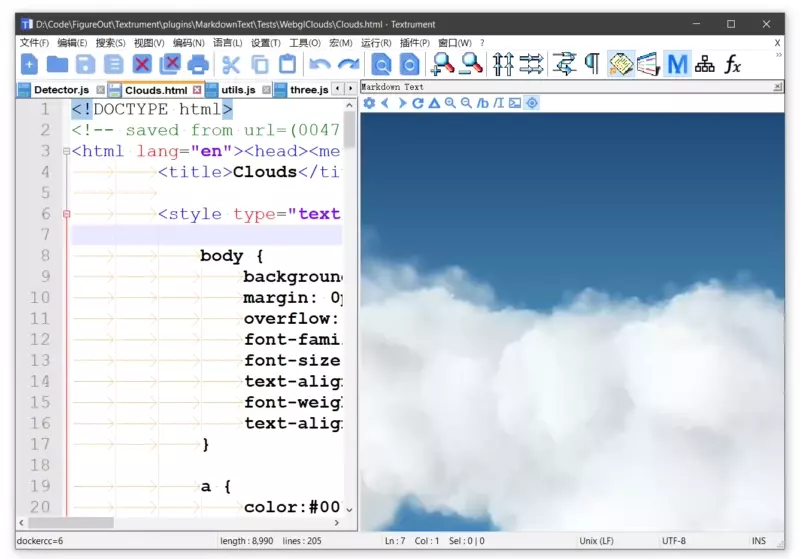

#  What's MarkDown Text? 
1. A new versatile markdown previewer based on [Miniblink](https://github.com/weolar/miniblink49), [Libcef](https://github.com/chromiumembedded/cef) and [Webview2](https://github.com/MicrosoftEdge/WebView2Samples) . The shipped renderers are based on **Remark.js**, **Marked.js** and **AsciiDoctor**. 
2. A **HTML** renderer and an offline **ShaderToy** previewer.
3. A part of the Textrument Editor Project. It needs to be compiled against [Textrument](https://github.com/KnIfER/Textrument) and is compatible with the "legacy editor".

# 头条功能
强大的 MarkDown Text 插件支持许多功能，现列其三要：
1. 可手动切换多种浏览器以及渲染器。多浏览器支持：各浏览器组件虽有着类似的源流，但性能、功效各有千秋，取长补短，善莫大焉。多渲染器支持：将纯文本转换为富文本的代码合集称为渲染器，不同格式的渲染器自然不同，支持HTML格式以及两大纯文本标记格式，可以自定义渲染器。
2. 预览面板可实时更新。默认在修改文件之后立即更新，直接从内存读取数据，响应迅速。亦可选择在保存文件时才更新预览。当运用于**图创文本** (**Textrument Editor**)之时，支持多个文件关联的“链式更新”。链式更新主要有两种应用场景，其一为修改样式文件之时链式更新主HTML之预览；其二为修改着色器代码之时链式更新ShaderToy之预览；其本质一也。
3. 同步编辑器与预览面板之滚动。愚做二法以成之，诚竭弩钝然仍有瑕，可关闭，余类者一禁而清。

# Top Features 
1. Multiple browser kernels and multiple text-to-html renderers among which you can pick your favorite on-the-fly.
2. Realtime updating of the rendered results. It can read in-memory buffers directly.
3. Synchronous scrolling via two approachs.

[Markdown Engines](https://github.com/KnIfER/Extesions/tree/master/MarkdownEngines)

[How to build a custom renderer](https://github.com/KnIfER/Extesions/tree/master/MarkdownEngines/HtmlDemo)

\
\
（本插件设置界面及部分警告、指示对话框基于Duilib制作。）

最低支持Win7，不支持XP。