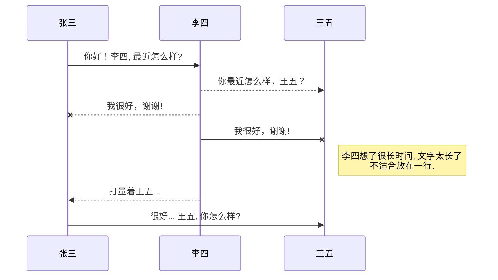
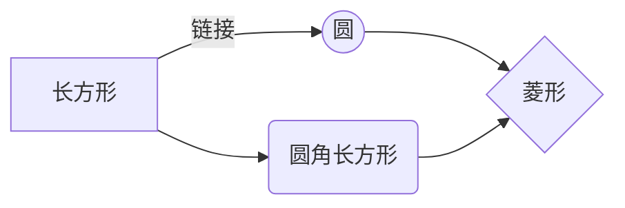
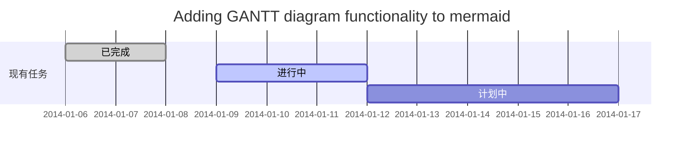
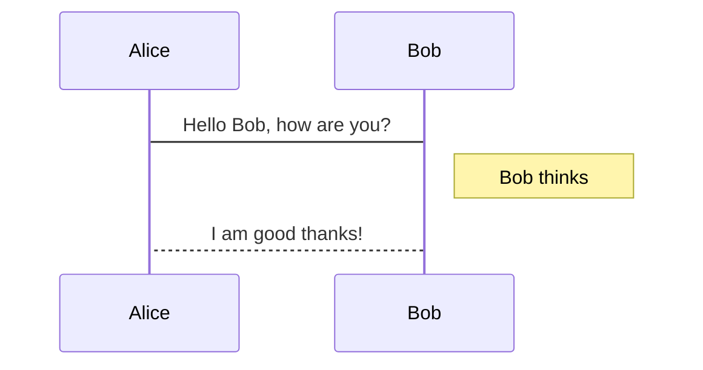
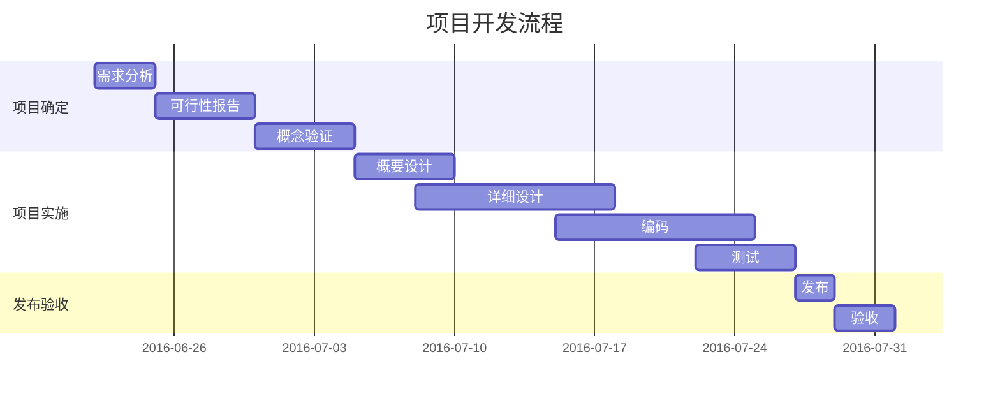

<ht>目录测试</ht>

[asd](123.png)

http://bilibili.com
   
# 一级目录

## SVG 图标

<b>overflow</b>
<svg width='30' height='30' viewBox='0 0 24 24'>
  <path fill='#00f' d='M12,7.6c1.21,0 2.2,-0.99 2.2,-2.2s-0.99,-2.2 -2.2,-2.2c-1.21,0 -2.2,0.99 -2.2,2.2S10.79,7.6 12,7.6zM12,9.8c-1.21,0 -2.2,0.99 -2.2,2.2s0.99,2.2 2.2,2.2c1.21,0 2.2,-0.99 2.2,-2.2S13.21,9.8 12,9.8zM12,16.4c-1.21,0 -2.2,0.99 -2.2,2.2s0.99,2.2 2.2,2.2c1.21,0 2.2,-0.99 2.2,-2.2S13.21,16.4 12,16.4z'/>
</svg>
<b>shopping</b>
<svg width='24.0' height='24.0' viewBox='0 0 24.0 24.0'>
  <path fill='#00f' d='M17,20A2,2 0,0 1,15 22A2,2 0,0 1,13 20A2,2 0,0 1,15 18A2,2 0,0 1,17 20M7,20A2,2 0,0 1,5 22A2,2 0,0 1,3 20A2,2 0,0 1,5 18A2,2 0,0 1,7 20M17.61,3C16.95,3 16.44,3.2 16,3.5C15.32,3.91 14.88,4.59 14.47,5.07L5.71,15.35C5.16,16 5.62,17 6.47,17H14C15.11,17 16,16.1 16,15V6.38C16.58,5.7 16.93,5 17.61,5C18.38,5 19,5.66 19,6.5V7H21V6.5C21,4.56 19.5,3 17.61,3Z'/>
</svg>

## Latex 样式测试

### 蝴蝶结 $\Join$或$\bowtie$

$\overline{Overline\ test}$

$\underline{UnderLine\ test}$


$\bold{Bold\ test}$

$\textit{Italic\ test}$


显示直立文本： $\textup{文本}$

意大利斜体： $\textit{文本}$

slanted斜体： $\textsl{文本}$

显示小体大写文本： 　$\textsc{文本}$

中等权重： $\textmd{文本}$

加粗命令： $\textbf{文本}$

默认值： $\textnormal{文本}$

斜体字：$\textit{italic}$，或者 $\emph{italic}$

细体字：$\textlf{light font}$

使用等宽字体：$\texttt{code}$

使用无衬线字体：$\textsf{sans-serif}$

所有字母大写：$\uppercase{CAPITALS}$

所有字母大写，但小写字母比较小：$\textsc{Small Capitals}$


<br/>
<br/>
<br/>
<br/>
<br/>
<br/>
<br/>
<br/>
<br/>
<br/>
<br/>
<br/>
<br/>

## Latex 公式，以及Sympy代码测试

https://github.com/waylonflinn/markdown-it-katex
$$\begin{array}{c}

\nabla \times \vec{\mathbf{B}} -\, \frac1c\, \frac{\partial\vec{\mathbf{E}}}{\partial t} &
= \frac{4\pi}{c}\vec{\mathbf{j}}    \nabla \cdot \vec{\mathbf{E}} & = 4 \pi \rho \\

\nabla \times \vec{\mathbf{E}}\, +\, \frac1c\, \frac{\partial\vec{\mathbf{B}}}{\partial t} & = \vec{\mathbf{0}} \\

\nabla \cdot \vec{\mathbf{B}} & = 0

\end{array}$$

---

$c = \sqrt{a^{2}+b_{xy}^{2}+e^{x}}$

$\Gamma(n) = (n-1)!\quad\forall$

Here we go !!!

:$\frac{\partial}{\partial}f(x)$

---

### 1. Derivatives of the Sine, Cosine and Tangent Functions

$\displaystyle\frac{{d{\left( \sin{{x}}\right)}}}{{{\left.{d}{x}\right.}}}= \cos{{x}}$

$\displaystyle\frac{{{d}{( \sin{{x}})}}}{{{{d}{x}}}}= \cos{{x}}$

```
from sympy import *
from sympy.abc import *
```
### 计算定积分：$\int_{0}^{n}({\sin{x}}^2) d{x}$
$\int_{0}^{n}({\sin{x}}^3) d{x}$
```
integrate(sin(x)**2,(x,0,n))
```

### 求和： $\sum_{x=0}^n{x}$
```
Sum(x,(x,0,n)).doit()

```

### 求导数：$\sin({x})'$  
aa = diff(sin(n),n)  
返回sin(n)关于n的一阶导数。

### 解微分方程：

```
dsolve(diff(f(x),x) - 2*f(x)*x,f(x))
```

但是需要提前指定f是函数：

f = Function('f')


```Java
int i=0; //asdasd
```
```Python
a = 0;
def f:
	adasd
#asdasd
```



Authors
:  John
:  Luke

*强调文本* _强调文本_

**加粗文本** __加粗文本__

==标记文本==



~~删除文本~~

> 引用文本  
> \
> asd

123
456

$H_2O$ is是液体。

$2^{10}$ 运算结果是 1024。






https://www.zybuluo.com/mdeditor



```flow
st=>start: 开始
e=>end: 结束
op=>operation: 我的操作
cond=>condition: 确认？

st->op->cond
cond(yes)->e
cond(no)->op
```


| 姓名 | 年龄 |  爱好 |
| -- | -- | -- |
| 小明 | 9 | 篮球<br>乒乓 |
| 小刚 | 10 | 篮球、足球 |